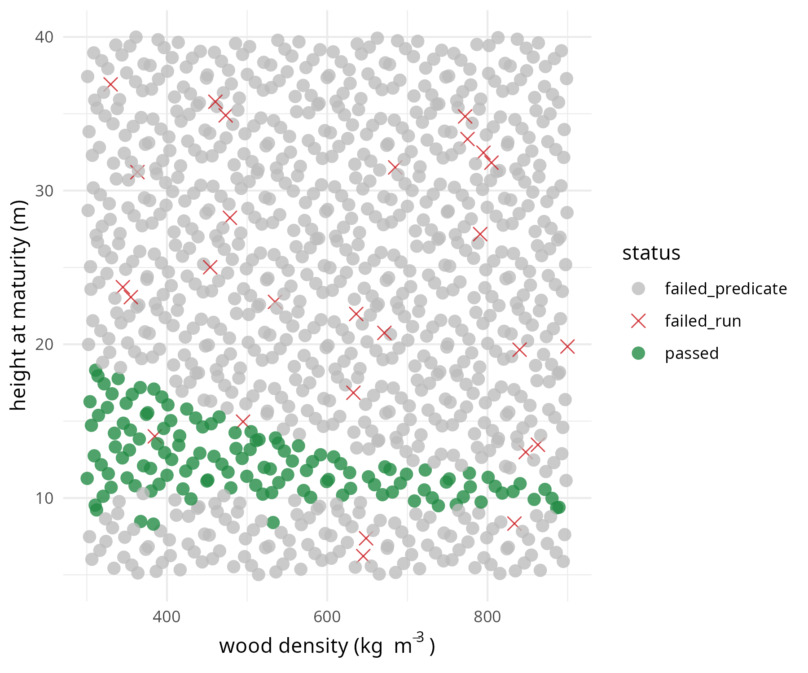

# logpile

A content-addressed cache for expensive, deterministic simulations. It ensures identical simulation inputs are never run twice. It was built for simulation-based calibration of the [`plant`](https://github.com/traitecoevo/plant) forest model.

Features:
- **Content-addressed:** Runs are uniquely identified by the SHA-256 hash of their inputs.
- **Fault-tolerant:** Crashes and timeouts are recorded as results, preventing endless retries of broken parameter sets.
- **Resumable:** Parallel campaigns automatically resume from their last completed state.

## Installation

```r
remotes::install_github("traitecoevo/logpile")
```

Requires R ≥ 4.1, `plant`, and a working Apache Arrow build. Parallel execution requires `crew`.

## Quickstart

```r
library(logpile)

pile <- create_pile("data/test_campaign")
set_active_pile(pile)

# 1. Define model and fixed inputs
template <- resolve_request(list(
  model_id = "FF16@v1",
  global = list(max_patch_lifetime = 105.32)
))

# 2. Define parameter ranges (priors)
priors <- list(
  rho  = c(500, 1200),
  hmat = c(3, 15)
)

# 3. Define ecological predicates
keep <- predicate_set(c(
  "allometry_in_range",
  "basal_area_bounded",
  "stem_density_bounded",
  "steady_structure"
))

# 4. Run simulations
m <- manifest(template, priors, n = 200, seed = 42)
fingerprints <- run(m, pile = pile)

# 5. Evaluate predicates and filter
evals <- evaluate_predicates(fingerprints, pile, keep)
passed_fps <- fingerprints[evals == "passed"]

# 6. Visualize the outcome
library(ggplot2)

df <- data.frame(m$coords, status = evals)

ggplot(df, aes(x = rho, y = hmat)) +
  geom_point(aes(shape = status, color = status), size = 3, alpha = 0.8) +
  scale_shape_manual(values = c("passed" = 16, 
                                "failed_predicate" = 16, 
                                "failed_run" = 4)) +
  scale_color_manual(values = c("passed" = "#238B45", 
                                "failed_predicate" = "#BDBDBD", 
                                "failed_run" = "#CB181D")) +
  theme_minimal() +
  labs(
    x = expression("wood density (kg " ~ m^{-3} ~ ")"),
    y = "height at maturity (m)"
  )
```



To run a campaign across multiple cores:

```r
m <- manifest(template, priors, n = 10000, seed = 42)
run(m, workers = 32)
```

## Exploring the Design Space

Find the nearest evaluated neighbors for a given parameter set:

```r
query <- matrix(c(800, 10), nrow = 1)
knn(query, k = 2, model = "FF16@v1", pile = pile)

#   rho hmat neighbor_rank fingerprint distance
# 1 800   10             1   c9f2a4b8...   1.451884
# 1 800   10             2   ecc9082s...   1.615842
```
This tells us the closest existing run to `(rho=800, hmat=10)` has the fingerprint `c9f2a4b8...` in the pile, and the distance to it is `1.45`.
Deepen coverage by finding the largest gap in the evaluated design space from a set of candidates:

```r
candidates <- data.frame(
  rho = c(600, 1000, 1100, 700), 
  hmat = c(5, 12, 14, 8)
)
gap(candidates, n = 1, model = "FF16@v1", pile = pile)

#   rho hmat fingerprint gap_distance
# 1 600    5     ecc9082s...     1.506975
```

The result indicates that the point `(rho=600, hmat=5)` is the best choice among the candidates to run next, as it sits in the largest gap (1.51 units away from any existing run).

## Architecture

- **Pile:** A two-layer storage system. A `storr` index maps hashes to run metadata. Parquet files store the bulk simulation data (logs, projections, and drivers). The pile periodically compacts small per-run files into partitioned blocks, leveraging Apache Arrow for exceptionally fast, memory-efficient reads across thousands of results.
- **Fingerprinting:** Inputs are resolved, converted to canonical CBOR via `secretbase`, and hashed. This guarantees deterministic identifiers across R versions.
- **Schemas:** Key logical components use a `name@version` namespace (e.g., models like `FF16@v1`, or projections like `stand_summary@v2`). Rather than hashing code, you manually bump the version when changing default parameters or aggregation logic, keeping old and new data cleanly separated.
- **Drivers:** Environmental forcing data is stored as Parquet and referenced by its hash within a run request, ensuring shared drivers are never duplicated. *Note: Driver ingestion is not yet settled; canonical hashing for massive gridded spatial datasets is an open question.*

## The Evaluation Pipeline

Evaluating whether a run is ecologically plausible follows a strict, stateless pipeline: `Raw Log → Transform → Projection → Predicate`.

1. **Check Status:** `evaluate_predicates` first checks the pile index. If a run crashed or timed out, it immediately returns `"failed_run"` or `"missing_run"`.
2. **Retrieve or Compute Projections:** Predicates operate on simplified "projections" of the data rather than massive raw logs. For each required projection:
    - It checks if the projection is cached in the pile. If so, it loads it instantly.
    - On a miss, it reads the **Raw Log** (Parquet) and applies a model-specific **Transform** hook (e.g., `transform_ff16`) to derive intermediate ecological quantities (like `basal_area`).
    - Finally, it applies the generic **Projection** aggregator (e.g., grouping by time and taking density-weighted means), caches the result back to the pile, and returns it.
3. **Evaluate Predicates:** With the projection in memory, the system runs the sequence of logical functions defined in your `predicate_set`.

You can define and register your own custom projections and predicates on the fly:

```r
my_proj <- projection(function(df) {
  df %>% 
    dplyr::group_by(fingerprint, t) %>% 
    dplyr::summarise(max_h = max(height, na.rm = TRUE), .groups = "drop")
}, "max_height@v1")

register_predicate("tall_enough", function(proj) proj$max_h > 10, "max_height@v1")
```

## Layout

```
<pile>/
  index/                       storr: fingerprint -> record
  raw/                         partitioned logs (parquet)
  projections/                 partitioned projections (parquet)
  drivers/                     environmental drivers (parquet)
```
